# Prisma Workflow Guide

Practical guide for working with Prisma in this repo — daily flow, what each `npm run db:*`
script does, and what happens to existing data on common schema changes. Written for someone
comfortable with code but new to Prisma.

ไทย 🇹🇭 อยู่ด้านล่างของแต่ละหัวข้อ (English ก่อน, ไทยตาม)

---

## 0. First-time setup on a new machine

**EN:** Cloning this repo on a machine that has never had this DB before:

```bash
npm install
npm run setup-env          # creates .env.dev (+ .env.prod) from .env.example
# edit DATABASE_URL in .env.dev to point at a running Postgres instance
# (docker-compose.yml here only runs the app itself, not a DB — have Postgres running separately)
npm run db:deploy          # apply every existing migration onto the empty DB
npm run db:generate        # deploy doesn't auto-generate — this step is required
npm run db:seed            # insert the seed accounts (login test users, see prisma/seeds/user.ts)
npm run dev
```

Use `db:deploy` here, not `db:migrate` — `migrate dev` is for when *you* are changing the
schema (it diffs and asks for a migration name); a fresh machine just needs to replay
migrations that already exist, which is exactly what `deploy` does non-interactively.

**ไทย:** Clone repo มาเครื่องที่ไม่เคยมี DB นี้มาก่อน:

```bash
npm install
npm run setup-env          # สร้าง .env.dev (+ .env.prod) จาก .env.example
# แก้ DATABASE_URL ใน .env.dev ให้ชี้ไปที่ Postgres ที่รันอยู่
# (docker-compose.yml ในนี้มีแค่ตัวแอป ไม่มี Postgres service ให้ ต้องมี DB รันแยกเอง)
npm run db:deploy          # apply migration ที่มีอยู่แล้วทั้งหมดลง DB เปล่า
npm run db:generate        # deploy ไม่ auto-generate ให้ ต้องรันเองจุดนี้
npm run db:seed            # ใส่ seed account ไว้ test login (ดู prisma/seeds/user.ts)
npm run dev
```

ใช้ `db:deploy` ตรงนี้ ไม่ใช่ `db:migrate` — `migrate dev` มีไว้สำหรับตอน**คุณเองกำลังแก้ schema**
(มัน diff แล้วถามชื่อ migration ใหม่) แต่เครื่องใหม่แค่ต้องการ replay migration ที่มีอยู่แล้ว
ซึ่งตรงกับหน้าที่ของ `deploy` ที่รันแบบ non-interactive พอดี

---

## 1. Daily dev loop

**EN:** Every time you change something under `prisma/schema/*.prisma`:

1. Edit the `.prisma` file (add/remove/rename a field, model, relation…).
2. Run `npm run db:migrate`. This will:
   - Diff your schema against the DB's migration history.
   - Ask you for a short migration name (e.g. `add-user-avatar`).
   - Create a new SQL file under `prisma/migrations/`.
   - Apply it to your local DB.
   - Regenerate the Prisma Client (`src/generated/prisma`) so your TS types match.
3. Code against the new types — no manual step needed, they're already updated.
4. Want to eyeball the data? `npm run db:studio` opens a local GUI in the browser.

**ไทย:** ทุกครั้งที่แก้ไฟล์ `.prisma`:

1. แก้ไฟล์ schema (เพิ่ม/ลบ/เปลี่ยนชื่อ field, model, relation)
2. รัน `npm run db:migrate` — ระบบจะ:
   - เทียบ schema ปัจจุบันกับประวัติ migration ใน DB
   - ถามชื่อ migration สั้นๆ (เช่น `add-user-avatar`)
   - สร้างไฟล์ SQL ใหม่ใน `prisma/migrations/`
   - apply ลง DB local ให้ทันที
   - generate Prisma Client ใหม่ (`src/generated/prisma`) ให้ type ตรงกับ schema ล่าสุด
3. เขียนโค้ดต่อได้เลย ไม่ต้องทำอะไรเพิ่ม type อัปเดตให้แล้ว
4. อยากดูข้อมูลจริงใน DB → `npm run db:studio` เปิด GUI ในเบราว์เซอร์

---

## 2. Command cheat sheet

| Command | What it does | When to use |
| --- | --- | --- |
| `npm run db:generate` | Regenerates Prisma Client types only. **No DB change.** | After `git pull` when a teammate added new migrations — syncs your local TS types. |
| `npm run db:migrate` | Diffs schema, creates + applies a new migration, regenerates client. | The main command while actively developing — every schema edit. |
| `npm run db:push` | Force-syncs schema straight to the DB, **no migration file created.** | Quick throwaway prototyping only. Never for real feature work — leaves no history, can't be deployed the same way to other environments. |
| `npm run db:deploy` | Applies existing, already-created migrations, no prompts, creates nothing new. | CI/CD and production deploys. Never run this expecting it to pick up new schema edits — it only replays what's already in `prisma/migrations/`. |
| `npm run db:studio` | Opens a local GUI to browse/edit table rows. | Inspecting seeded data, debugging, manual data fixes in dev. |
| `npm run db:reset` | **Drops the whole local DB**, replays every migration from scratch, then re-runs the seed. | "Start clean" button — local dev only. Never in production (see §4). |
| `npm run db:seed` | Runs `prisma/seed.ts` standalone to insert baseline data. | After `db:push`/manual DB changes, or anytime you want the seed accounts back without a full reset. |

| คำสั่ง | ทำอะไร | ใช้ตอนไหน |
| --- | --- | --- |
| `npm run db:generate` | generate type ของ Prisma Client ใหม่เท่านั้น **ไม่แตะ DB** | หลัง `git pull` แล้วเพื่อนเพิ่ม migration ใหม่มา — sync type ให้ตรง |
| `npm run db:migrate` | เทียบ schema, สร้าง+apply migration ใหม่, generate client ให้ | คำสั่งหลักตอน dev — ใช้ทุกครั้งที่แก้ schema |
| `npm run db:push` | บังคับ sync schema ลง DB ตรงๆ **ไม่สร้างไฟล์ migration** | prototype เร็วๆ ทิ้งได้เท่านั้น ห้ามใช้กับงานจริง เพราะไม่มีประวัติ ย้ายไป environment อื่นแบบเดียวกันไม่ได้ |
| `npm run db:deploy` | apply migration ที่มีอยู่แล้ว ไม่ถาม ไม่สร้างใหม่ | ใช้ตอน deploy CI/CD หรือ production เท่านั้น อย่าหวังว่ามันจะจับ schema ที่เพิ่งแก้ — มันแค่ replay ไฟล์ที่มีอยู่ใน `prisma/migrations/` |
| `npm run db:studio` | เปิด GUI local ดู/แก้ข้อมูลในตาราง | ตรวจข้อมูลที่ seed ไว้, debug, แก้ข้อมูลมือระหว่าง dev |
| `npm run db:reset` | **ลบ DB local ทั้งหมด** แล้ว replay migration ทุกไฟล์ใหม่ตั้งแต่ต้น แล้ว seed ให้อัตโนมัติ | ปุ่ม "เริ่มใหม่ให้สะอาด" ใช้ local dev เท่านั้น ห้ามรันใน production (ดู §4) |
| `npm run db:seed` | รัน `prisma/seed.ts` เพื่อใส่ข้อมูลพื้นฐานเข้า DB | หลัง `db:push`/แก้ DB มือ หรืออยากได้ seed account กลับมาโดยไม่ต้อง reset ทั้งหมด |

---

## 3. What happens to data on common schema changes

### Removing a field

**EN:**
- **Column has no data (empty table, or all rows are `NULL`/never used)** — safe. `db:migrate` drops the column, nothing is lost, migration applies cleanly.
- **Column has real data in it** — the data in that column **is permanently deleted** the moment the migration applies. `migrate dev` will show a warning like *"You are about to drop the column `x`, which still contains data"* and ask you to confirm — but confirming does delete it, there's no undo. Back up (`db:studio` export, or a manual `SELECT`/pg_dump) before removing a field that holds real data.

**ไทย:**
- **Column ไม่มีข้อมูล (ตารางว่าง หรือทุกแถวเป็น `NULL`/ไม่เคยใช้)** — ปลอดภัย `db:migrate` จะลบ column ไปเฉยๆ ไม่มีอะไรหาย migration ผ่านได้ปกติ
- **Column มีข้อมูลจริงอยู่** — ข้อมูลใน column นั้น**หายถาวรทันทีที่ migration apply** `migrate dev` จะเตือนก่อนว่า *"กำลังจะลบ column x ที่ยังมีข้อมูลอยู่"* และให้ confirm — แต่กด confirm แล้วคือหายจริง กู้คืนไม่ได้ ถ้า column นั้นมีข้อมูลจริงที่สำคัญ ให้ backup ก่อน (export จาก `db:studio` หรือ `SELECT`/`pg_dump` มือ) ก่อนลบ

### Changing a field from optional to required (`String?` → `String`)

**EN:**
- **Every existing row already has a non-null value in that column** — no impact, migration applies fine, the `NOT NULL` constraint is just formalizing what's already true.
- **Some existing rows have `NULL` in that column** — the migration **fails to apply**. Postgres refuses to add a `NOT NULL` constraint while rows violate it. You have two options:
  1. Add a `@default(...)` in the schema so Prisma backfills existing `NULL`s with that default as part of the migration.
  2. Manually edit the generated migration SQL to `UPDATE` and backfill real values for existing `NULL` rows *before* the `ALTER COLUMN ... SET NOT NULL` line.

**ไทย:**
- **ทุกแถวที่มีอยู่แล้วมีค่าไม่เป็น null ใน column นั้นอยู่แล้ว** — ไม่กระทบอะไร migration ผ่านปกติ แค่ทำให้ constraint ตรงกับสภาพจริงที่เป็นอยู่แล้ว
- **มีบางแถวที่ column นั้นเป็น `NULL` อยู่** — **migration จะ apply ไม่ผ่าน** Postgres จะปฏิเสธการเพิ่ม `NOT NULL` ถ้ายังมีแถวที่ผิดเงื่อนไขอยู่ มีทางแก้ 2 แบบ:
  1. ใส่ `@default(...)` ใน schema ให้ Prisma backfill ค่า default ให้แถวที่เป็น `NULL` เป็นส่วนหนึ่งของ migration อัตโนมัติ
  2. แก้ไฟล์ migration SQL ที่ generate มาเอง เพิ่มคำสั่ง `UPDATE` ใส่ค่าจริงให้แถวที่เป็น `NULL` ก่อน แล้วค่อยให้บรรทัด `ALTER COLUMN ... SET NOT NULL` รันทีหลัง

---

## 4. "Wipe everything and start fresh" (dev only)

**EN:** When you've been iterating on the schema a lot and don't care about the current local
data anymore:

```bash
npm run db:reset
```

This drops the entire local DB, replays every migration file from scratch (so the DB ends up
schema-identical to what a fresh clone + `db:deploy` would produce), then automatically runs
the seed script. **This is destructive and only makes sense against your local dev DB** — never
run it against staging/production, it deletes everything with no confirmation prompt beyond the
initial one.

**ไทย:** ตอนแก้ schema ไปเรื่อยๆ จนไม่สนใจข้อมูล local เดิมแล้ว:

```bash
npm run db:reset
```

คำสั่งนี้จะลบ DB local ทั้งหมด แล้ว replay ไฟล์ migration ทุกไฟล์ใหม่ตั้งแต่ต้น (ผลลัพธ์ schema จะ
เหมือนกับ clone ใหม่แล้วรัน `db:deploy`) จากนั้นรัน seed script ให้อัตโนมัติ **คำสั่งนี้ทำลายข้อมูล
ใช้กับ DB local เท่านั้น** ห้ามรันใส่ staging/production เด็ดขาด เพราะลบทุกอย่างโดยไม่มีการถามซ้ำ
นอกจาก prompt แรก

---

## 5. Visual flow

```mermaid
flowchart TD
    subgraph new["New machine / first install"]
        A1["git clone + npm install"] --> A2["npm run setup-env<br/>edit DATABASE_URL"]
        A2 --> A3["npm run db:deploy<br/>(replay existing migrations)"]
        A3 --> A4["npm run db:generate<br/>(deploy skips this — do it manually)"]
        A4 --> A5["npm run db:seed"]
        A5 --> A6["npm run dev"]
    end

    subgraph loop["Ongoing dev — editing schema.prisma"]
        B1["Edit prisma/schema/*.prisma<br/>(model / field / enum change)"] --> B2["npm run db:migrate"]
        B2 --> B3["auto: new migration file created"]
        B3 --> B4["auto: applied to local DB"]
        B4 --> B5["auto: prisma generate runs"]
        B5 --> B6["TS types ready — keep coding"]
    end

    subgraph nuke["Want a clean slate locally"]
        C1["npm run db:reset"] --> C2["DB dropped"]
        C2 --> C3["all migrations replayed"]
        C3 --> C4["seed re-run automatically"]
    end
```



- **New machine** (top): DB is empty → `deploy` replays history, `generate` must be run by hand.
- **Ongoing dev** (middle): schema changes → `migrate` handles create + apply + generate in one shot.
- **Clean slate** (bottom): `reset` is `deploy` + `seed` combined, but destroys local data first — dev only.
